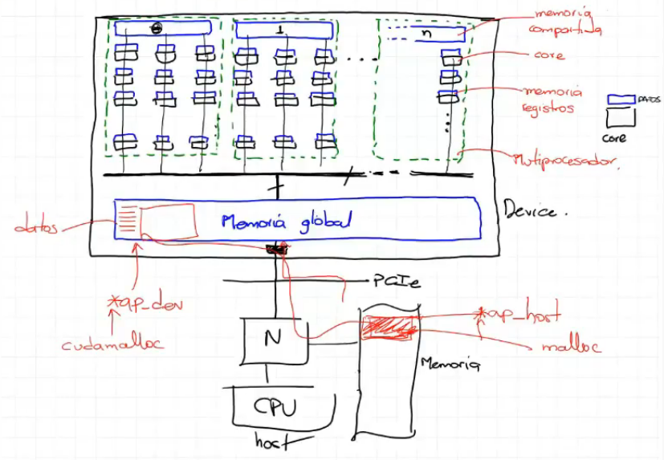

# CUDA

* **Materia:** Computación paralela y distribuida
* **Resumen realizado por:** Guiselle Tatiana Zambrano Penagos

## Conceptos básicos

{ .center width=200 }

A la CPU se le agregó un componente conocido como memoria caché.

{ .center width=300 }

La tarjeta gráfica se encarga de generar gráficos ya que estos requieren una gran
capacidad de cómputo, suelen realizar tareas como:
-   Cálculos físicos.
-   Renderización.
-   Manejo de texturas ...

Si tuvieramos un programa en la memoria principal y este requiriera calculos
intensivos o algo para gráficos, esas operaciones serían enviadas a la tarjeta
gráfica y cuando se tuvieran los resultados, se devuelverían al programa
principal.

Las operaciones relacionadas con gráficos, era usualmente altamente
paralelizables.

{  .center width=200}

La **CPU** trabajará como _Maestro_ y la **tarjeta gŕafica** como _Esclavo_.

El sistema operativo está en la memoria principal, no en la tarjeta gráfica, por
lo tanto en este último **no hay llamadas del sistema**, solamente operaciones
aritmético lógicas.

El **Kernel** se encarga de gestionar las llamadas del sistema, este interactúa
con la CPU, la memoria y la tarjeta gráfica; este posee controladores que le
permiten entenderse con esta última, se incorporará un cuda driver que va a
incluir una librería llamada **cuda runtime** y se encargará de comunicar el
programa con la tarjeta gráfica.

Al ejecutar un programa que necesite correr algo en la tarjeta gráfica, se
realizará una llamada al sistema, el sistema operativo detendrá la ejecución, se
transladará el código que se quiere ejecutar en la tarjeta gráfica y al terminar
los resultados se transladaran al programa de usuario.

# Introducción a la plataforma CUDA

Permite desarrollar programas de propósito general sobre tarjetas gráficas. Está
soportado en varios lenguajes de programación y para varios sistemas operativos.

## Librerías

Existen varias librerías que facilitan portar un programa a una tarjeta gráfica.

{ .center width=300 }

Nvidia incorpora un compilador de cuda **nvcc** (Nvidia CUDA compiler). Lo que
hará este compilador es dividir el programa entre lo que ejecutará el CPU y lo
que ejecutará la tarjeta gráfica usando funciones de CUDA, donde será en este
último donde el compilador traducira las instrucciones a lenguaje máquina y
trabajará con los núcleos o cores de la tarjeta gráfica. Por otro lado, el código
que será procesado por la CPU, será compilado utiizando gcc o g++.

## Directivas

La librería OpenACC busca utilizar directivas para dividir la parte paralela del
programa, para utilizarla se deben tener en cuenta varios factores para su
adecuado funcionamiento.

## Lenguajes de programación

-   Numerical analytics: MATLAB, Mathematica, LabVIEW.
-   Fortran: OpenACC, **CUDA Fortran**.
-   **C:** OpenACC, **CUDA C**.
-   **C++:** Thrust, **CUDA C++**.
-   Python: PyCUDA, Copperhead.
-   F#: Alea.cuBase.

CUDA está para Fortran, C y C++.

# CUDA C/C++

CUDA (Compute Unified Device Architecture). Hecho en principio en C y C++.

## Computación Heterogenea

Hacer uso de CPU y GPU.
-   **Host:** Espacion del CPU.
-   **Device:** Espacio del GPU.

{ .center width=200 }

En la GPU cada core tiene una **memoria de registro** que les permitirá trabajar
de forma local sin necesidad de acceder a la memoria global. Hay una memoria que
ponen por cada cierto número de nucleos denominada **memoria compartida**, donde
accederan un grupo determinado de núcleos. El conjunto de la memoria compartida
y cores (con sus propias memorias de registro) que tienen acceso a la misma se
denomina **Multiprocesadror**.

{ .center width=300 }

Desde la CPU se transfieren datos a la memoria global de la GPU, en esta memoria
quedarán datos y codigos que serán ejecutados, cada hilo almacenará su resultado
en la memoria global para ser llevado de vuelta a la CPU.

{ .center width=300}
</div>

La transferencia de información entre la GPU y CPU se hará por medio de punteros.

{ .center width=300 }

```C
__global__ void mykernel(void){
    // arithmetic and logical functions
}

int main(void){
    mykernel<<<1, 1>>>();
    printf("Hello World\n");
    return 0;
}
```
**Ejemplo:** Suma de 2 vectores. Cada elemento será operado por un hilo.

{ .center width=200 }

En el siguiente código las variables `d_a, d_b` y `d_c` apuntarán a un espacio en
la memora gobal de la **GPU**.

La función `cudaMemcpy()` pide como parámetros el destino, el origen, la cantidad
de datos y la dirección en la que se hará la copia.

La función `cudaMalloc()` requiere la dirección del apuntador (**NO** la
dirección a la que apunta este)para modificarla, por este motivo tiene doble
asterisco.

```C
__global__ void add(int *a, int *b, int *c){
    *c = *a + *b;
}
int main(void){
    int a, b, c;            // host copies of a, b, c
    int *d_a, *d_b, *d_c:   // device copies of a, b, c;
    int size = sizeof(int);

    // Allocate space for device copies of a, b, c
    cudaMalloc((void **)&d_a, size);
    cudaMalloc((void **)&d_b, size);
    cudaMalloc((void **)&d_c, size);

    // Setup input values
    a = 2;
    b = 7;

    // Copy inputs to device
    cudaMemcpy(d_a, &a, size, cudaMemcpyHostToDevice);
    cudaMemcpy(d_b, &b, size, cudaMemcpyHostToDevice);

    // Launch add() kernel on GPU
    add<<<1,1>>>(d_a, d_b, d_c);

    // Copy result back to host
    cudaMemcpy(&c, d_c, size, cudaMemcpyDeviceToHost);

    // Cleanup
    cudaFree(d_a); cudaFree(d_b); cudaFree(d_c);
    return 0;
}
```

## Bloques

### Punto de vista desde los Hilos

La configuración lógica de la GPU, conciste en el manejo de los hilos en la misma.
Un hilo se ejecuta en un core, un grupo de hilos se ejecuta en un conjunto de
cores que comparten memoria denominada multiprocesador, también llamado streaming
multiprocessor (**SM**). El conjunto de hilos que se corre en el multiprocesador
se denomina bloque. El conjunto de bloques se denomina **Grid** y este se
ejecutará que múltiples múltiprocesadores (SM) que conforman la GPU.

{ .center width=200 }

### Punto de vista desde la memoria

{ .center width=200 }

La memoria global es fabricada con tecnología **DRAM**, es dinámica, tiene como
ventaja que esta puede ser de gran tamaño, y como deventaja que la misma no es
tan rápida como una memoria estática (**SRAM**), que es la tecnología con la que
se fabrican las memorias caché de los procesadores.

{ .center width=200 }

En el siguiente fragmento de código, el **N** representa el número de bloques que
se de sea lanzar.

```
add<<<N, 1>>>
```
Para identificar a cuál bloque pertenece un hilo, es necesario utilizar la
variable `blockIdx.x`, la cual sirve para hacer referencia al bloque del hilo
que se está usando.

```C
#define N 512 //Vector size

__global__ void add(int a*, int b*, int c*) {
    c[blockId.x] = a[blockId.x] + b[blockId.x];
}

int main(void){
    int *a, *b, *b;         // host copies of a, b, c
    int *d_a, *d_b, *d_b;   // device copies of a, b, c
    int size = N *sizeof(int);

    // Alloc space for device copies of a, b, c
    cudaMalloc((void**)&d_a, size);
    cudaMalloc((void**)&d_b, size);
    cudaMalloc((void**)&d_c, size);

    // Alloc space for host copies of a, b, c and setup input values
    a = (int *)malloc(size); random_ints(a, N);
    b = (int *)malloc(size); random_ints(b, N);
    c = (int *)malloc(size);

    cudaMemcpy(d_a, a, size, cudaMemcpyHostToDevice);
    cudaMemcpy(d_b, b, size, cudaMemcpyHostToDevice);

    // Launch add() kernel on GPU with N blocks -> It's a bad practice
    add<<<N, 1>>>(d_a, d_b, d_c);

    // Copy result back to host
    cudaMemcpy(c, d_c, size, cudaMemcpyDeviceToHost);

    // Cleanup
    free(a); free(b); free(c);
    cudaFree(d_a); cudaFree(d_b); cudaFree(d_c);
    return 0;
}
```

Si se usan más bloques de los disponibles en la GPU, estos se encolan y se pierde
el paralelismo.

## Hilos

Para indexar dentro de un bloque se utiliza la variable `threadIdx.x`, por lo tanto la función `main()` quedaría de la siguiente forma:

```C
#define N 512
int main(void){
    int *a, *b, *b;         // host copies of a, b, c
    int *d_a, *d_b, *d_b;   // device copies of a, b, c
    int size = N *sizeof(int);

    // Axiiiiikkkkijkjdskjdsjfor device copies of a, b, c
    cudaMalloc((void**)&d_a, size);
    cudaMalloc((void**)&d_b, size);
    cudaMalloc((void**)&d_c, size);

    // Alloc space for host copies of a, b, c and setup input values
    a = (int *)malloc(size); random_ints(a, N);
    b = (int *)malloc(size); random_ints(b, N);
    c = (int *)malloc(size);

    cudaMemcpy(d_a, a, size, cudaMemcpyHostToDevice);
    cudaMemcpy(d_b, b, size, cudaMemcpyHostTioDevice);

    // Launch add() kernel on GPU with N threads
    add<<<1, N>>>(d_a, d_b, d_c);

    // Copy result back to host
    cudaMemcpy(c, d_c, size, cudaMemcpyDeviceToHost);

    // Cleanup
    free(a); free(b); free(c);
    cudaFree(d_a); cudaFree(d_b); cudaFree(d_c);
    return 0;
}
```

## Indexación

Se lanzarán múltiples bloques, donde cada uno lanza múltiples hilos que manejarán un elemento del
array.

{ .center width=300 }

La variable `threadIdx.x` variará entre 0-7 y `blockIdx.x` variará entre 0-3.

Para indexar los elementos del array con su respectivo hilo en los múltiples bloques es necesario
realizar la siguiente operación

```C
int index = threadIdx.x + blockIdx.x * M;
```
Donde `M` es la cantidad de hilos por bloque.

{ .center width=200 }

Para obtener el número de hilos por bloque es necesario utilizar la variable `blockDim.x`

```C
int index = threadIdx.x + blockIdx.x * blockDim.x;
```


## Memoria compartida
## Sincronización
## Manejo de errores
## Múltiples dispositivos